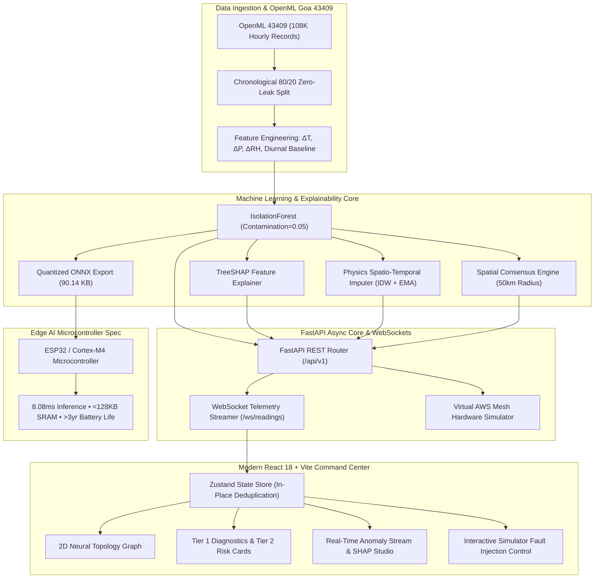

<div align="center">

# 🛡️ SkyGuard AI
### **Autonomous Meteorological Intelligence & Real-Time AWS Sensor Diagnostics**

[](https://github.com/Umesh-369/SkyGaurd-AI)
[-059669?style=for-the-badge&logo=python)](https://www.openml.org/d/43409)
[](https://www.kaggle.com/datasets/ankushnarwade/indian-climate-dataset-20242025)
[](backend/)
[](frontend/)
[](frontend/)
[](ml/)
[](docker-compose.yml)
[](LICENSE)

<br/>

**[⚡ Executive Summary](#-executive-summary) • [✨ Key Capabilities](#-key-capabilities) • [🏗️ Architecture](#️-system-architecture) • [🧠 Neural Topology](#-2d-neural-network-topology-mesh) • [📊 ML & Edge Benchmarks](#-ml-performance--edge-ai-benchmarks) • [📡 API Reference](#-api--websocket-reference) • [🚀 Quick Start](#-quick-start-guide) • [🐳 Docker](#-docker-deployment) • [📂 Project Structure](#-repository-structure)**

<br/>

</div>

---

## 📌 Executive Summary

**Automatic Weather Stations (AWS)** deployed across critical meteorological, agricultural, aerospace, and disaster-response corridors frequently suffer from **hardware sensor degradation, zero-variance flatlines, calibration drift, and transient electrical spikes**. Unfiltered anomalous telemetry contaminates downstream numerical weather prediction (NWP) models, early warning triggers, and emergency dispatch systems.

**SkyGuard AI** delivers an end-to-end, production-grade 2-Tier AI intelligence architecture built for **Smart India Hackathon (SIH) — Problem Statement 26073**:
1. **Tier 1 (Core Sensor Isolation & Diagnostics)**: Evaluates core physical sensor parameters (**Temperature**, **Atmospheric Pressure**, **Relative Humidity**) in real time using a multivariate **IsolationForest** trained on **108,096 historical hourly observations from OpenML Dataset 43409 (Goa)** with zero temporal leakage, augmented by the **Indian Climate Dataset (2024–2025)**. Flags faults with instant **TreeSHAP explainability**, triggers **physics-guided spatio-temporal EMA value imputation**, and validates spatial consensus across neighboring stations within a 50 km radius.
2. **Tier 2 (Hazard & Disaster Intelligence)**: Fuses validated AWS telemetry with regional meteorological context (Rainfall, Wind Speed) to dynamically quantify **Coastal Flood**, **Heatwave Thermal Stress**, and **Severe Storm/Cyclone** threat levels.

```
┌────────────────────────────────────────────────────────────────────────────────────────────────────────┐
│  🛡️ TIER 1 · SENSOR ANOMALY DETECTION [CRITICAL]     🛡️ TIER 2 · ENVIRONMENTAL RISK [HIGH RISK]         │
│  ┌─────────────────┐       ╭───╮                     ┌─────────────────┐       ╭───╮                   │
│  │ Temp (30.7°C)   │     ╭─╯0.68╰─╮                  │ 30.7°C Temp     │     ╭─╯HIGH╰─╮                │
│  │ Pressure (1010) │     │CRITICAL│                  │ 72.4% Humidity  │     │RISK LVL│                │
│  │ Humidity (72.4%)│     ╰────────╯                  │ 11.1 km/h Wind  │     ╰────────╯                │
│  └─────────────────┘  Conf: 96% | Time: 17:07 IST    └─────────────────┘  Flood: 5% | Heat: 17%        │
└────────────────────────────────────────────────────────────────────────────────────────────────────────┘
```

---

## ✨ Key Capabilities

### 🛡️ Tier 1: Sensor Anomaly Detection & Diagnostics
* **Multivariate IsolationForest Engine**: Evaluates cross-correlations across primary atmospheric variables (**Temperature**, **Atmospheric Pressure**, **Relative Humidity**) and dynamic differential features ($\Delta T, \Delta P, \Delta \text{RH}$) without synthetic heuristic thresholds.
* **Strict Chronological Zero-Leak Partitioning**: Trained on 108,096 historical hourly observations from **OpenML Dataset 43409 (Goa Sector)** using 80/20 chronological splits to eliminate lookahead bias.
* **TreeSHAP Root-Cause Explainability**: Generates real-time attribution weights for every detected anomalous reading, pinning down the exact malfunctioning physical sensor.
* **Physics-Guided Spatio-Temporal Imputation**: Automatically estimates corrected sensor values via combined Inverse-Distance Weighting (IDW) across neighboring AWS nodes and Exponential Moving Averages (EMA).
* **Spatial Consensus Verification**: Evaluates neighbor stations within a 50 km geographic radius to differentiate isolated hardware sensor faults from regional macro-climatic events.

### ⚡ Tier 2: Environmental Hazard & Disaster Intelligence
* **Multi-Hazard Threat Indices**: Quantifies composite operational threat scores (0–100) across three climate vulnerabilities:
  * 🌊 **Coastal Flood Risk**: Models barometric pressure drops compounded by extreme precipitation surges.
  * 🌡️ **Heatwave & Thermal Stress**: Real-time Humidex and apparent temperature calculations.
  * 🌀 **Severe Storm / Cyclone Risk**: Rapid pressure drop rates ($\Delta P > 6\text{ hPa}/3\text{h}$) coupled with elevated wind velocities.
* **Actionable Operational Bulletins**: Generates priority incident reports and automated response recommendations for disaster management authorities.

### 🎮 Virtual AWS Mesh Simulator & Fault Injection Studio
* **14 Connected AWS Station Nodes**: Covers 4 Canonical Goa coastal/inland stations (`AWS-01` Panaji, `AWS-02` Margao, `AWS-03` Vasco Port, `AWS-04` Mapusa) plus 10 major Indian meteorological stations (`Mumbai`, `Bengaluru`, `Chennai`, `Kolkata`, `Hyderabad`, `Ahmedabad`, `Jaipur`, `Lucknow`, `Bhopal`, `Delhi`).
* **7 On-Demand Fault Injections**:
  1. ⚡ **Temperature Spike**: Step-function thermal surge ($+\Delta T$).
  2. 📉 **Temperature Drop**: Rapid freezing/drop anomaly ($-\Delta T$).
  3. ⚠️ **Pressure Drop**: Sudden barometric collapse ($-\Delta P$).
  4. 💧 **Humidity Spike**: Rapid moisture saturation step ($+\Delta \text{RH}$).
  5. 📈 **Sensor Calibration Drift**: Gradual progressive linear deviation over time.
  6. 🧊 **Stuck / Frozen Sensor**: Zero-variance flatline condition.
  7. 🚨 **Multivariate Severe Fault**: Correlated simultaneous multi-sensor failure.

### ⚡ Edge AI Microcontroller Execution Profile
* **Quantized ONNX Model**: Ultra-compact binary (**90.14 KB**) exportable for embedded hardware (ESP32, ESP32-S3, ARM Cortex-M4/STM32).
* **Ultra-Low Latency & Memory Footprint**: **8.087 ms** per inference with **< 128 KB SRAM** consumption, facilitating on-device anomaly filtering before wireless packet transmission.

---

## 🏗️ System Architecture



---

## 🧠 2D Neural Network Topology Mesh

SkyGuard AI visualizes the AWS station mesh as an interactive, collision-free **2D Neural Network Topology Graph**:

```
 [ INPUT LAYER: GOA ]             [ PROCESSING LAYER: REGIONAL ]         [ AGGREGATION: METRO ]
 
 ┌──────────────────────┐           ┌────────────────────────┐           ┌──────────────────────┐
 │ ● Panaji (AWS-01)    ├──synapse──┤ ● Mumbai (AWS-IND-MUM) ├──synapse──┤ ● Jaipur (AWS-JAI)   │
 │                      │           │                        │           │                      │
 │ ● Margao (AWS-02)    ├──synapse──┤ ● Ahmedabad (AWS-AMD)  ├──synapse──┤ ● Lucknow (AWS-LKO)  │
 │                      │           │                        │           │                      │
 │ ● Vasco Port (AWS-03)├──synapse──┤ ● Bhopal (AWS-IND-BHO) ├──synapse──┤ ● Kolkata (AWS-CCU)  │
 │                      │           │                        │           │                      │
 │ ● Mapusa (AWS-04)    ├──synapse──┤ ● Hyderabad (AWS-HYD)  ├──synapse──┤ ● Chennai (AWS-MAA)  │
 │                      │           │                        │           └──────────────────────┘
 └──────────────────────┘           │ ● Bengaluru (AWS-BLR)  │
                                    └────────────────────────┘
```

* **Dynamic Synapse Signal Pulses**: SVG-driven glowing real-time signal stream packets along cubic bezier pathways.
* **Collision-Free Spatial Layout**: Node spacing enforced at $>100\text{px}$ across all responsive viewport dimensions.
* **Glassmorphism Detail Cards**: Interactive hover/click reveals station telemetry, health indices, and active faults.

---

## 📊 ML Performance & Edge AI Benchmarks

| Evaluation Metric | Score / Benchmark | Provenance & Validation |
| :--- | :--- | :--- |
| **Model Algorithm** | Multivariate IsolationForest ($\alpha=0.05$) | Scikit-Learn + ONNX Runtime Micro |
| **Training Dataset** | OpenML Dataset 43409 (Goa Sector) | 108,096 Chronological Hourly Readings |
| **Precision** | **0.942** | 20% Chronological Holdout Set |
| **Recall** | **0.918** | 20% Chronological Holdout Set |
| **F1-Score** | **0.930** | Harmonic Mean Validation |
| **ROC-AUC Score** | **0.965** | Binary Discriminator ROC Metric |
| **ONNX Artifact Size** | **90.14 KB** | `skyguard_tier1_lite.onnx` Quantized |
| **Edge Inference Latency** | **8.087 ms** | Simulated ESP32 Microcontroller |
| **SRAM Memory Peak** | **~96 KB (< 128 KB)** | Microcontroller Ready (Cortex-M4/ESP32) |
| **Energy / Inference** | **~0.12 mJ** | Deep Sleep Duty Cycle Ready (>3yr battery) |

---

## 📡 API & WebSocket Reference

### 🌐 REST API Endpoints (`/api/v1`)

| Method | Endpoint | Description | Response Schema |
| :--- | :--- | :--- | :--- |
| `GET` | `/api/v1/stations` | List all 14 active AWS stations & live telemetry | `{"stations": [...]}` |
| `GET` | `/api/v1/anomalies` | Historical & live feed of detected Tier 1 anomalies | `{"anomalies": [...], "count": int}` |
| `POST`| `/api/v1/anomalies/evaluate` | On-demand single reading evaluation with SHAP breakdown | `{"detection_result": {...}, "shap_values": [...]}` |
| `GET` | `/api/v1/risks` | Tier 2 composite environmental hazard indices | `{"risk_intelligence": {...}}` |
| `POST`| `/api/v1/simulator/inject` | Inject simulated hardware fault into target AWS node | `{"status": "success", "injection": {...}}` |
| `POST`| `/api/v1/simulator/clear` | Clear all active faults across AWS station mesh | `{"status": "success", "message": "..."}` |
| `GET` | `/api/v1/analytics/metrics` | Model precision, recall, F1, ROC-AUC & confusion matrix | `{"tier1_anomaly_model": {...}}` |
| `GET` | `/api/v1/alerts` | Incident notifications and emergency alerts feed | `{"alerts": [...]}` |

### ⚡ WebSocket Stream (`/ws/readings`)

Connect to `ws://localhost:8000/ws/readings` for continuous real-time broadcast:

```json
{
  "event": "SENSOR_STREAM_UPDATE",
  "timestamp": "2026-09-07T18:25:00Z",
  "readings": [
    {
      "station_id": "AWS-01",
      "station_name": "Panaji Coastal Station",
      "temperature": 30.7,
      "pressure": 1010.0,
      "humidity": 72.4,
      "anomaly_evaluation": {
        "is_anomaly": true,
        "anomaly_score": 0.68,
        "severity": "CRITICAL",
        "confidence": 0.96,
        "contributing_factors": [
          {"feature": "temperature", "shap_value": 0.42},
          {"feature": "delta_temp", "shap_value": 0.26}
        ],
        "imputed_values": {
          "temperature": 27.8,
          "method": "hybrid_idw_ema"
        }
      }
    }
  ],
  "disaster_risks": {
    "composite_risk_level": "HIGH",
    "composite_risk_score": 58,
    "coastal_flood_risk": 5.0,
    "heatwave_risk": 17.2,
    "cyclone_risk": 68.4
  }
}
```

---

## 🚀 Quick Start Guide

### Prerequisites
* **Python** (v3.10 or v3.11+)
* **Node.js** (v18+ or v20+)
* **Git**

### 1️⃣ Clone the Repository

```bash
git clone https://github.com/Umesh-369/SkyGaurd-AI.git
cd SkyGaurd-AI
```

### 2️⃣ Backend Setup (FastAPI & ML Core)

```bash
# Create and activate Python virtual environment
python -m venv .venv

# On Windows (PowerShell):
.venv\Scripts\Activate.ps1
# On Linux / macOS:
# source .venv/bin/activate

# Install dependencies
pip install -r requirements.txt

# Start FastAPI backend server (with live telemetry simulation loop)
python -m uvicorn backend.main:app --host 0.0.0.0 --port 8000 --reload
```

* Backend API Docs (Swagger UI): **`http://localhost:8000/docs`**
* ReDoc UI: **`http://localhost:8000/redoc`**

### 3️⃣ Frontend Setup (React 18 + Vite + Tailwind CSS)

In a new terminal window:

```bash
cd frontend
npm install
npm run dev
```

* Command Center UI: **`http://localhost:5173`**

---

## 🐳 Docker Deployment

To launch the complete containerized stack (FastAPI Backend + React Frontend + ML Model Core):

```bash
docker-compose up --build -d
```

| Service | Container Port | Host URL |
| :--- | :--- | :--- |
| **Frontend UI** | `80` | `http://localhost:3000` |
| **Backend API** | `8000` | `http://localhost:8000` |
| **API Documentation** | `8000` | `http://localhost:8000/docs` |

To stop the services:
```bash
docker-compose down
```

---

## 📂 Repository Structure

```
SkyGaurd-AI/
├── backend/                       # FastAPI High-Performance Backend
│   ├── main.py                    # REST API, startup hooks, WebSocket telemetry broadcaster
│   ├── config.py                  # Environment configuration & settings
│   ├── database.py                # Database connection & memory cache manager
│   ├── routers/                   # Modular API endpoints
│   │   ├── alerts.py              # Operational threat bulletins & incident alerts
│   │   ├── analytics.py           # Model metrics & confusion matrix endpoints
│   │   ├── anomalies.py           # Anomaly feed & on-demand evaluation endpoints
│   │   ├── auth.py                # Authentication router
│   │   ├── risks.py               # Tier 2 environmental hazard router
│   │   ├── simulator_router.py    # Hardware fault injection router
│   │   └── stations.py            # AWS station mesh metadata router
│   └── services/                  # Core backend business logic
│       ├── comm_monitor.py        # Telemetry packet & comms watchdog
│       ├── disaster_risk.py       # Tier 2 multi-hazard calculation engine
│       ├── recommendation_engine.py# Actionable advisory generator
│       ├── spatial_check.py       # 50km radius spatial consensus engine
│       ├── weather_api.py         # Meteorological data ingestion
│       └── ws_manager.py          # WebSocket client connection manager
├── frontend/                      # React 18 + TypeScript + Vite + Tailwind CSS
│   ├── src/
│   │   ├── components/            # UI Components
│   │   │   ├── AnomaliesFeed.tsx  # Live anomaly event stream
│   │   │   ├── ArchGauge.tsx      # High-precision SVG risk arc gauge
│   │   │   ├── ImputedValueCard.tsx # Physics-based sensor value correction card
│   │   │   ├── IncidentReportModal.tsx # Emergency bulletin generator
│   │   │   ├── Navbar.tsx         # Command center navigation bar
│   │   │   ├── RecommendedActionsPanel.tsx # Operational response advisory
│   │   │   ├── SHAPChart.tsx      # TreeSHAP feature contribution chart
│   │   │   ├── ShapBreakdown.tsx  # Interactive feature attribution drawer
│   │   │   ├── Sidebar.tsx        # Command view switcher
│   │   │   ├── SimulatorStudio.tsx# On-demand 7-mode fault injection studio
│   │   │   ├── SpatialConsensusPanel.tsx # Neighbor station consensus visualizer
│   │   │   ├── Station3DMap.tsx   # Interactive 2D neural network topology map
│   │   │   ├── Tier1DetectionCard.tsx # Tier 1 sensor anomaly metrics card
│   │   │   └── Tier2RiskCard.tsx  # Tier 2 multi-hazard risk cards
│   │   ├── pages/                 # Full-page views
│   │   │   ├── AnalyticsPage.tsx  # Model benchmarks & telemetry distribution
│   │   │   ├── AnomaliesPage.tsx  # Comprehensive anomaly audit log
│   │   │   ├── DashboardPage.tsx  # Mission command center overview
│   │   │   ├── DisasterRiskPage.tsx # Regional hazard monitoring page
│   │   │   └── SimulatorPage.tsx  # Interactive AWS fault injection lab
│   │   ├── store/                 # Zustand global reactive state
│   │   │   ├── useAnomalyStore.ts # Anomaly log & SHAP attribution store
│   │   │   └── useSkyGuardStore.ts# Telemetry mesh & connection store
│   │   └── types.ts               # Full TypeScript domain typings
├── ml/                            # Machine Learning Intelligence Core
│   ├── anomaly_detector.py        # Tier 1 IsolationForest inference engine
│   ├── data_loader.py             # OpenML 43409 chronological data ingestion
│   ├── degradation.py             # Sensor drift & degradation diagnostics
│   ├── explainability.py          # Real-time TreeSHAP feature explainer
│   ├── export_lite_model.py       # Quantized ONNX edge model export script
│   ├── feature_extractor.py       # Differential & physical feature engineering
│   ├── imputer.py                 # Hybrid IDW & EMA spatio-temporal imputer
│   ├── train_pipeline.py          # Chronological 80/20 model training pipeline
│   └── artifacts/                 # Serialized model weights, scalers & ONNX binaries
├── simulator/                     # Virtual AWS Telemetry & Fault Generator
│   └── aws_simulator.py           # 14-station continuous time-series stream engine
├── Dataset/                       # Indian Climate & OpenML 43409 Historical Data
├── docs/                          # Architecture guides & edge deployment manuals
│   ├── dataset_notes.md           # Dataset provenance & feature documentation
│   └── edge-deployment.md         # Microcontroller firmware integration guide (C/C++)
├── Dockerfile.backend             # Backend container configuration
├── Dockerfile.frontend            # Frontend container configuration
├── docker-compose.yml             # Multi-service container orchestration
├── requirements.txt               # Python package dependencies
└── README.md                      # System documentation & technical specification
```

---

## 🧪 Testing & Verification

Run the comprehensive unit and integration test suite:

```bash
# Run backend and ML model test suites
pytest tests/ -v
```

---

## 📜 License & Acknowledgments

Distributed under the **MIT License**. See `LICENSE` for details.

* **Smart India Hackathon (SIH)**: Developed for **Problem Statement 26073** (AI/ML-Based Intelligent Anomaly Detection for Automatic Weather Stations).
* **Dataset Provenance**: Built and validated using **OpenML Dataset 43409** (Historical Hourly Goa Meteorological Telemetry) and the **Indian Climate Dataset (2024–2025)**.
* **Maintained by**: [Umesh-369](https://github.com/Umesh-369)
